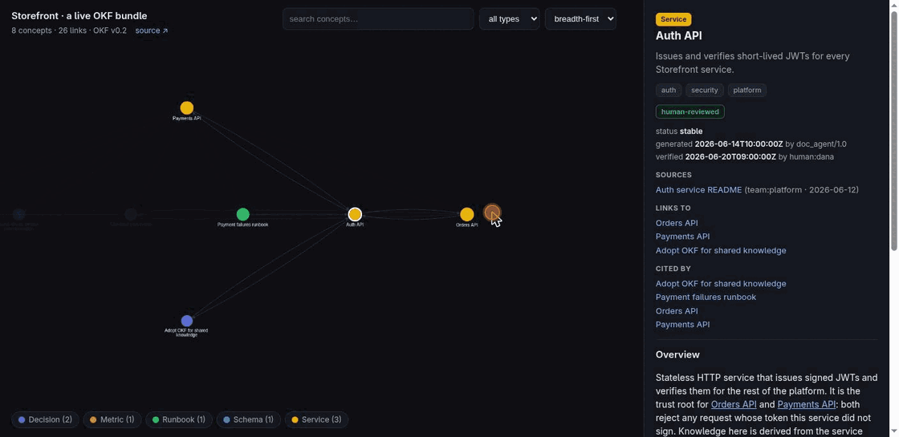

<div align="center">

# 📚 okf: the Open Knowledge Format toolkit for Claude Code

**Teach your coding agent to author, maintain, validate, and *visualize* portable
knowledge bundles: markdown your team and your agents both read.**

Built for **OKF v0.2** (trust signals, provenance, staleness), while the rest of
the ecosystem still targets v0.1.

[](LICENSE)
[](skills/okf/reference/SPEC.md)
[](https://code.claude.com/docs/en/plugins)
[](https://skills.sh/scaccogatto/okf-skills)
[](#contributing)

### ▶ [**Open the live demo**](https://scaccogatto.github.io/okf-skills/): a real OKF bundle as an interactive graph

[](https://scaccogatto.github.io/okf-skills/)

*Click any node for rendered markdown, the derived trust tier and staleness, provenance with its credibility signals, and "Links to / Cited by" backlinks. No backend, nothing leaves the page.*

```shell
/plugin install okf@scaccogatto
npx skills add scaccogatto/okf-skills
```

</div>

---

> [**OKF**](https://cloud.google.com/blog/products/data-analytics/how-the-open-knowledge-format-can-improve-data-sharing)
> is an open, vendor-neutral format (announced by Google Cloud, June 2026) that
> represents knowledge (the context and curated insight around your systems) as a
> directory of markdown files with YAML frontmatter. No schema registry, no
> runtime, no SDK. If you can `cat` a file you can read it; if you can `git clone`
> a repo you can ship it.

This is the **Claude Code-native** OKF toolchain. It teaches Claude to
**produce, maintain, consume, validate, and visualize** OKF bundles as a normal
part of how it already works, driven by the verbatim spec, backed by a
deterministic conformance checker, with a self-contained graph renderer. Ships as
a **Claude Code plugin**, as **agent skills** (Cursor, Codex, and 20+ agents), and
as a **GitHub Action** for repos with no agent at all. Every other tool in
[Google's community list](https://github.com/GoogleCloudPlatform/knowledge-catalog)
still targeted v0.1 when we checked on 2026-07-27; this one is v0.2 throughout.

> 🪞 **This repo documents itself in OKF.** The architecture, skills, and decisions
> behind okf-skills live in [`.okf/`](.okf/), explorable as a
> [**live self-graph**](https://scaccogatto.github.io/okf-skills/self.html). CI
> validates that bundle on every push (dogfooding the conformance checker).

## Install

**As a Claude Code plugin:**

```shell
/plugin marketplace add scaccogatto/okf-skills
/plugin install okf@scaccogatto
```

**As agent skills via [skills.sh](https://skills.sh/scaccogatto/okf-skills)** (Claude Code, Cursor, Codex, and 20+ agents):

```shell
npx skills add scaccogatto/okf-skills            # the okf, validate & visualize skills
```

**Local development** (no marketplace): `claude --plugin-dir /path/to/okf-skills`.

Both layouts coexist in this one repo: `.claude-plugin/` makes it a plugin
marketplace, `skills/<name>/SKILL.md` makes it skills.sh-discoverable. Scripts live
inside their skills and are referenced via `${CLAUDE_SKILL_DIR}`, so they work in
either path. The scripts need [`uv`](https://docs.astral.sh/uv/) (or `python3` + `pyyaml`).

## Use it

**Capture knowledge**: ask Claude to "document the auth service in OKF", or run:

```shell
/okf:okf produce .okf
```

**Validate** before committing:

```shell
/okf:validate .okf --strict
# or directly, zero-config:
uv run skills/validate/scripts/okf_validate.py .okf --strict
# gate in CI while some warnings are still outstanding:
uv run skills/validate/scripts/okf_validate.py .okf --max-warnings 5
```

**Gate it in CI**: the composite action works in any repo, with or without Claude Code:

```yaml
- uses: scaccogatto/okf-skills@v1
  with:
    bundle: .okf
    strict: "true"      # or: max-warnings: "5"
```

**Visualize** the knowledge graph, a self-contained `viz.html` that opens in any
browser ([live example](https://scaccogatto.github.io/okf-skills/)):

```shell
/okf:visualize .okf
# or directly, with a title and a back-link to your repo:
uv run skills/visualize/scripts/okf_visualize.py .okf \
  -o viz.html --title "My project" --link "https://github.com/me/project"
```

Every concept gets a shareable deep link (`viz.html#services/auth-api` opens with
that concept selected). Each panel carries two **derived** badges: the §5.3 trust
tier (*unverified* / *machine-confirmed* / *human-reviewed*) and staleness once
`stale_after` is past. OKF stores neither (a stored tier is a stored opinion, and
it goes stale), so both are computed at render time.

**Keep it up to date.** Two opt-in ways to make upkeep automatic:

- **Soft mode:** paste [`templates/CLAUDE-okf.md`](templates/CLAUDE-okf.md) into
  your project's `CLAUDE.md` (or `~/.claude/CLAUDE.md`) to have Claude consult
  `.okf/` before tasks and write knowledge back after changes.
- **Enforced mode:** add `upkeep: enforced` to `.okf/index.md`'s frontmatter to
  arm the plugin's dormant `Stop` hook, which then blocks finishing when tracked
  files changed but `.okf/log.md` wasn't updated. Off by default; a user overrides
  any bundle with `OKF_HOOK=off`. Full gate sequence:
  [stop-hook concept](.okf/components/stop-hook.md).

## What's inside

| Component | What it does |
|-----------|--------------|
| `/okf:okf` skill | Produce / maintain / consume bundles, applying the spec and templates. Auto-triggers when a repo has an OKF bundle. |
| `/okf:validate` skill | Deterministic §11 conformance check (not an eyeball pass). |
| `/okf:visualize` skill | Render a bundle to a self-contained interactive HTML graph (`viz.html`). |
| `skills/okf/scripts/okf_init.py` | Scaffold a conformant starter bundle in one shot. |
| `skills/validate/scripts/okf_validate.py` | Standalone, zero-config validator (`uv run`, PyYAML via PEP 723). |
| `skills/visualize/scripts/okf_visualize.py` | Standalone bundle→`viz.html` renderer. |
| `skills/okf/reference/SPEC.md` | The OKF v0.2 spec, vendored verbatim: the source of truth. |
| `templates/CLAUDE-okf.md` | Snippet that turns on automatic consume/maintain in your project. |
| `action.yml` | Composite GitHub Action to gate a bundle in any repo's CI, no Claude Code needed. |
| `examples/sample-bundle/` | The conformant bundle behind the [live demo](https://scaccogatto.github.io/okf-skills/). |

## How a bundle looks

A bundle is a directory of markdown files; a concept's path is its ID. The only
rule for conformance is YAML frontmatter with a non-empty `type`; everything else
is optional.

```
.okf/
├── index.md                  # progressive disclosure (root carries okf_version)
├── log.md                    # ISO-dated change history, newest first
├── services/auth-api.md      # one concept = one file; path is its ID
├── decisions/use-okf.md
└── metrics/checkout-conversion.md
```

```markdown
---
type: Service
title: Auth API
description: Issues and verifies short-lived access tokens.
resource: https://github.com/acme/auth
status: stable
generated: { by: doc_agent/1.0, at: 2026-06-14T10:00:00Z }
verified: { by: human:dana, at: 2026-06-20T09:00:00Z }
sources:
  - id: auth-readme
    resource: https://github.com/acme/auth#readme
    title: Auth service README
---

# Endpoints
Tokens live 15 minutes.[^auth-readme]

[^auth-readme]: Auth service README
```

## What OKF v0.2 adds

v0.2 assumes a corpus that agents keep writing, so it makes four things answerable
from frontmatter alone. All optional; a concept carrying only `type` is still fully
conformant. Full normative detail is in [`SPEC.md`](skills/okf/reference/SPEC.md).

| Family | Fields | Answers |
|--------|--------|---------|
| **Provenance** | `sources[]` + `author` / `usage_count` / `last_modified`, `usage_window` | Where did this come from, and how credible is that source? |
| **Trust** | `generated: {by, at}`, `verified[]`, actor convention (`human:` / `process:` / `agent/version`) | Who wrote it, who confirmed it? |
| **Lifecycle** | `status`, `stale_after` | Is it current? Is it still true? |
| **Attestation** | `type: Attested Computation` + `runtime`, `parameters`, `executor`, `attester` | Was this number produced the sanctioned way? |

**Upgrading from v0.1?** `--migrate` rewrites the two superseded constructs
(`timestamp` → `generated.at`, body `# Citations` → `sources`) in place, textually
and idempotently. The tools read both meanwhile and flag the old forms as warnings,
never errors; `--strict` is the nudge, `--migrate` is the door:

```shell
uv run skills/validate/scripts/okf_validate.py .okf --migrate --strict
```

## Repository layout

```
okf-skills/
├── .claude-plugin/{plugin.json, marketplace.json}
├── skills/{okf, validate, visualize}/{SKILL.md, scripts/}
├── hooks/                         # the dormant Stop hook
├── examples/sample-bundle/        # the live-demo bundle
├── docs/                          # GitHub Pages: the live interactive demo
├── templates/CLAUDE-okf.md
├── action.yml                     # the CI-gating GitHub Action
├── Makefile                       # make docs / test / validate; CI runs the same
└── .github/workflows/ci.yml
```

## Contributing

Issues and PRs welcome: new templates, producers for more sources, validator and
visualizer improvements. CI validates the plugin manifest and the example bundle on
every push. Releases are automatic: bump `version` in `.claude-plugin/plugin.json`
and merging to `main` tags and publishes `okf--v<version>` on its own.

## Credits & license

- The **Open Knowledge Format** specification is by the Google Cloud Data Cloud
  team, released under Apache-2.0. `skills/okf/reference/SPEC.md` is vendored
  verbatim from the [reference repository](https://github.com/GoogleCloudPlatform/knowledge-catalog/tree/main/okf)
  with attribution.
- This plugin's own code and content: **MIT** © Marco Boffo ([@scaccogatto](https://github.com/scaccogatto)).
